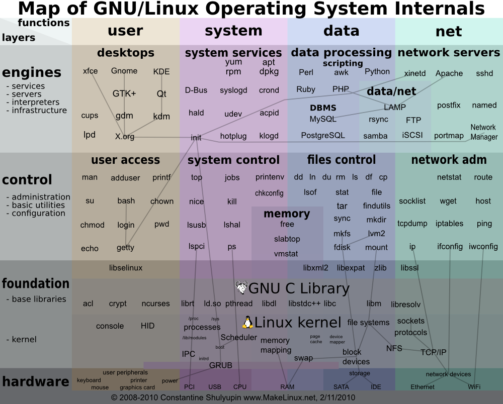

# Linux

   Linux，最早由Linus Benedict Torvalds在1991年开始编写。在这之前，Richard Stallman创建了Free Software Foundation（FSF）组织以及GNU项目，并不断的编写创建GNU程序（此类程序的许可方式均为GPL: General Public License）。在不断的有杰出的程序员和开发者加入到GNU组织中后，便造就了今天我们所看到的Linux，或称GNU/Linux。

* Linux的发行版本可以大体分为两类：
   * 一类是商业公司维护的发行版本（以著名的Redhat（RHEL）为代表）
   * 一类是社区组织维护的发行版本（以Debian为代表）
<div align="center">  </div><br>

## 一、Linux 发行版：

* 1、Redhat系列

      国内使用人群最多的Linux版本、使用人群数量大，资料非常多
      
   * RHEL(Redhat Enterprise Linux，也就是所谓的Redhat Advance Server，收费版本)
   * Fedora Core(由原来的Redhat桌面版本发展而来，免费版本)
   * CentOS(RHEL的社区克隆版本，免费)。

````
   Redhat应该说是在国内使用人群最多的Linux版本，甚至有人将Redhat等同于Linux，而有些老鸟更是只用这一个版本的
   Linux。所以这个版本的特点就是使用人群数量大，资料非常多，言下之意就是如果你有什么不明白的地方，很容易找到
   人来问，而且网上的一般Linux教程都是以Redhat为例来讲解的。Redhat系列的包管理方式采用的是基于RPM包的YUM包
   管理方式，包分发方式是编译好的二进制文件。稳定性方面RHEL和CentOS的稳定性非常好，适合于服务器使用，但是
   Fedora Core的稳定性较差，最好只用于桌面应用。
````
* 2、Debian系列

      是社区类Linux的典范，是迄今为止最遵循GNU规范的Linux系统
      
   * Debian
      * stable
      * testing
      * unstable
   * Ubuntu
````
   Debian是社区类Linux的典范，是迄今为止最遵循GNU规范的Linux系统。Debian最早由Ian Murdock于1993年创建，分为
   三个版本分支（branch）： stable, testing 和 unstable。其中，unstable为最新的测试版本，其中包括最新的软件
   包，但是也有相对较多的bug，适合桌面用户。testing的版本都经 过unstable中的测试，相对较为稳定，也支持了不少新
   技术（比如SMP等）。而stable一般只用于服务器，上面的软件包大部分都比较过时，但是 稳定和安全性都非常的高。
   Debian最具特色的是apt-get / dpkg包管理方式，其实Redhat的YUM也是在模仿Debian的APT方式，但在二进制文件发行
   方式中，APT应该是最好的了。Debian的资 料也很丰富，有很多支持的社区，有问题求教也有地方可去。
````
* 3、Ubuntu

      近乎完美的 Linux桌面系统
      
   * 基于Gnome的Ubuntu
   * 基于KDE的Kubuntu
   * 基于Xfc的 Xubuntu
````
   Ubuntu，严格来说不能算一个独立的发行版本，Ubuntu是基于Debian的unstable版本加强而来，可以这么说，Ubuntu就是
   一个拥有Debian所有的优点，以及自己所加强的优点的近乎完美的 Linux桌面系统。根据选择的桌面系统不同，有三个版本
   可供选择，基于Gnome的Ubuntu，基于KDE的Kubuntu以及基于Xfc的 Xubuntu。特点是界面非常友好，容易上手，对硬件的
   支持非常全面，是最适合做桌面系统的Linux发行版本。
````
* 4、Gentoo

      完美的Linux发行版本
````      
   Gentoo是一个基于Linux的自由操作系统，它能为几乎任何应用程序或需求自动地作出优化和定制。追求极限的配置、性能，
   以及顶尖的用户和开发者社区，都是Gentoo体验的标志特点。 Gentoo的哲学是自由和选择。得益于一种称为Portage的技
   术，Gentoo能
   成为理想的安全服务器、开发工作站、专业桌面、游戏系统、嵌入式解决方案或者别的东西——你想让它成为什么，它就可以
   成为什么。
````
* 5、FreeBSD

      自由的、免费的类UNIX操作系统
````
   FreeBSD是一种类UNIX操作系统，是由经过BSD、386BSD和4.4BSD发展而来的Unix的一个重要分支。FreeBSD 为不同架构
   的计算机系统提供了不同程度的支持。并且一些原来BSD UNIX的开发者后来转到FreeBSD的开发，使得FreeBSD在内部结构
   和系统API上和UNIX有很大的兼容性。由于FreeBSD宽松的法律条款，其代码被好多其他系统借鉴包括苹果公司的macOS，
   正因此由于MacOS X的UNIX兼容性，使得macOS获得了UNIX商标认证。
   FreeBSD支持amd64(x86_64)、X86（i386）、ARM、IA-64、PowerPC、PC-98、SPARC等架构
   （不同版本支持有所不同）（详细情况见官方文档）。
````
* 6、SUSE Linux
````
   SUSE Linux，简称"SuSE"，发音为/zuz/，意思为"Software- und System-Entwicklung"，这是一句德文，
   英文为"Software and system development"。现在这家公司的名字再度更改成SUSE Linux。它原是德国的 
   SuSE Linux AG公司发行维护的Linux发行版，是属于此公司的注册商标。2004年这家公司被Novell公司收购。
   广义上SUSE Linux是一系列Linux发行版，第一个版本出现在1994年初，SUSE现存的最古老的商业发行版之一，
   起源于德国，而SUSE Linux 针对个人用户。SUSE Linux原是以Slackware Linux为基础，并提供完整德文使
   用界面的产品。1992年 Peter McDonald成立了Softlanding Linux System(SLS)这个发行版。这套发行版包
   含的软件非常多，更首次收录了X Window及TCP/IP等套件。Slackware就是一个基于SLS的发行版。
````
* 7、Mandriva

      是目前全球最优秀的Linux发行版之一，稳居于linux排行榜第一梯队,2005年之前稳居linux排行榜NO.1。
      它是目前最易用的linux发行版，也是众多国际级linux发行版中唯一一个默认即支持中文环境的linux。

````
   Mandriva是法国的Mandriva公司（前身为Mandrake公司）开发的Linux发行版。Mandriva公司现在仍然是欧洲最大的
   Linux厂商，Mandriva Linux的前身为著名的Mandrake Linux。Mandriva（Mandrake）项目是世界上第一个为非技术类
   用户设计的易于使用、安装和管理的linux版本。Mandriva（Mandrake Linux）早期方便的字体安装工具和默认的中文支
   持，为Linux普及做出了很大的贡献。现在的Mandriva是由mandrake和Conectiva结合发展而来的。
````
* 8、Slackware
````
   Slackware Linux是由Patrick Volkerding开发的GNU/Linux发行版。与很多其他的发行版不同，它坚持
   KISS(Keep It Simple Stupid)的原则。一开始，配置系统会有一些困难，但是更有经验的用户会喜欢这种方式的透明性
   和灵活性。
   Slackware 很多特性体现出了KISS原则，最为有名的一些例子就是不依赖图形界面的文本化系统配置、传统的服务管理方式
   和不解决
   依赖的包管理方式。它的最大特点就是安装灵活，目录结构严谨，版本力求稳定而非追新。Slackware的软件包都是通常的
   tgz(tar/gzip) 或者txz(xz) 格式文件再加上安装脚本。Tgz/Txz 对于有经验的用户来说，比RPM更为灵活，并避免了APT 
   之类管理器可能带来的的依赖地狱。
````


## 二、Linux 发行版(移动)：
* 1、Android
````
   Android是一种基于Linux的自由及开放源代码的操作系统，主要使用于移动设备，如智能手机和平板电脑，由Google公司和
   开放手机联盟领导及开发。尚未有统一中文名称，中国大陆地区较多人使用“安卓”或“安致”。Android操作系统最初由
   Andy Rubin开发，主要支持手机。2005年8月由Google收购注资。2007年11月，Google与84家硬件制造商、软件开发商及电
   信营运商
   组建开放手机联盟共同研发改良Android系统。随后Google以Apache开源许可证的授权方式，发布了Android的源代码。
   第一部Android
   智能手机发布于2008年10月。Android逐渐扩展到平板电脑及其他领域上，如电视、数码相机、游戏机等。2011年第一季度，
   Android在全球的市场份额首次超过塞班系统，跃居全球第一。 2013年的第四季度，Android平台手机的全球市场份额已经
   达到78.1%。
   2013年09月24日谷歌开发的操作系统Android在迎来了5岁生日，全世界采用这款系统的设备数量已经达到10亿台。
   
   2014第一季度Android平台已占所有移动广告流量来源的42.8%，首度超越iOS。但运营收入不及iOS。
````
* 2、MeeGo
````
   MeeGo是一种基于Linux的自由及开放源代码的便携设备操作系统。它在2010年2月的全球移动通信大会中发布，主要推动者为
   诺基亚与英特尔。MeeGo融合了诺基亚的Maemo及英特尔的Moblin平台，并由Linux基金会主导。MeeGo主要定位在移动设备、
   家电数码等消费类电子产品市场，可用于智能手机、平板电脑、上网本、智能电视和车载系统等平台。2011年9月28日，
   继诺基亚宣布放弃开发meego之后，英特尔也正式宣布将MeeGo与LiMo合并成为新的系统：Tizen。2012年7月，
   在诺基亚的支持下，Jolla Mobile公司成立。并基于Meego研发sailfish os，将在华发布新一代Jolla手机。
   
   2013年10月诺基亚宣布，他们将在2014年1月1日正式停止向MeeGo和塞班两款操作系统提供支持。
   
   2014年1月1日，诺基亚正式停止Nokia Store应用商店内的塞班和MeeGo应用的更新，也禁止开发人员发布新应用。
````
* 3、Chrome OS
````
   Chrome OS是一款Google开发的基于PC的操作系统。 Google Chrome OS是一款基于Linux的开源操作系统。
   Google在自己的官方博客表示，初期，这一操作系统将定位于上网本、紧凑型以及低成本电脑。这款开源软件将被命名为
   Chrome OS，谷歌公司于2010年12月7日（北京时间12月8日2点30分）在美国举行Chrome相关产品发布会，
   发布会上正式发布Chrome Web store和Chrome OS。
````
* 4、webOS

      webOS，是一个嵌入式操作系统。
````
   Palm webOS是一个嵌入式操作系统，以Linux内核为主体并加上部份Palm公司开发的专有软件。它主要是为Palm 智能
   手机而开发。
   该平台于2009年1月8日的拉斯维加斯国际消费电子展宣布给公众，并于2009年6月6日发布。该平台是事实上的PalmOS
   继任者，webOS将在线社交网络和Web 2.0一体化作为重点。第一款搭载webOS系统的智能手机是Palm Pre，
   于2009年6月6日发售。
   由于Palm被HP收购，webOS被收归HP旗下。2011年8月19日凌晨，在惠普第三季度财报会议上，惠普宣布正式放弃围绕
   TouchPad平板电脑和webOS手机的所有运营。
````
* 5、Tizen

      该系统整合了LiMo和MeeGo两个操作系统。
````      
   Tizen（中文名：泰泽）是两大Linux联盟 LiMo Foundation和 Linux Foundation整合资源优势，携手英特尔和
   三星电子，共同开发针对手机和其它设备的操作系统。该系统整合了BADA和MeeGo两个操作系统，并于2012年2月正式公布。

````
* 6、BADA
````
   bada是韩国三星电子自行开发的智能手机平台，底层为Linux核心。支援丰富功能和用户体验的软件应用，
   于2009年11月10日发布。
   bada在韩语裏是“海洋”的意思。
   bada的设计目标是开创人人能用的智能手机的时代。它的特点是配置灵活、用户交互性佳、面向服务优。
   非常重视SNS整合和基于位置服务应用。
````

### 三、Linux 发行版（国内 ）：
* 1、红旗Linux
````
   红旗Linux是由北京中科红旗软件技术有限公司开发的一系列Linux发行版，包括桌面版、工作站版、数据中心服务器
   版、HA集群版和红旗嵌入式Linux等产品。红旗Linux是中国较大、较成熟的Linux发行版之一。
````
* 2、Kylin
````
   Kylin操作系统是国家高技术研究发展计划（863计划）的重大成果之一，是以国防科技大学为主导，与中软、联想等单位
   联合设计和开发的具有完全自主版权，可支持多种微处理器和多种计算机体系结构，具有高性能、高可用性和高安全性，
   并与Linux应用二进制兼容的国产中文服务器操作系统。
````
* 3、华镭通用操作系统RAYS
````
   华镭通用操作系统RAYS 是由新华科技系统软件有限公司自主研发的中文Linux操作系统。它在Linux稳定内核的基础上
   融合了多项先进技术，能全面满足政府、公司、个人、家庭在办公、娱乐、学习和教育等多方面的应用需求。此外，
   华镭通用操作系统全面支持包括龙芯、众志在内的多款国产CPU，实现了“国产CPU+国产操作系统+国产应用软件”的完整产
   业链。
````
* 4、Magic Linux
````
   Magic Linux是一个新的Linux发行，简称 MGC，是针对中国人的版本，由中国Linux公社的社区会员和Linux爱好者制作
   的中文 Linux 发行版，现基于Fedora修改而来。Magic Linux的目的很简单：让大家真正地用Linux，而不是去一个接
   一个的汉化Linux。
   Magic Linux的口号是：没有实现不了的梦。
````
* 5、共创Linux
````
   共创Linux桌面操作系统，功能丰富，可以部分地替代现有常用的Windows桌面操作系统。它采用类似于Windows XP
   风格的图形用户界面，符合Windows XP的操作习惯，让用户使用起来感觉更熟悉，更易用，降低了培训成本。
   提供了优秀的中文支持能力，字体显示效果十分美观。
   高度智能化的中文拼音输入法，使 用方便、输入效率高，达到Windows下拼音输入法同等的水平。
````

### 四、Linux 服务器：
* 1、CentOS
* 2、Ubuntu
* 3、FreeBSD

      是另外一种类UNIX内核，不属于Linux，适做服务器就是采用FreeBSD，据说是性能最强劲的。但内核不一样。

### 五、Linux发行版（表格）
<table> 
   <tr>
      <th rowspan="3">基于Debian</th>
      <td>Debian</td>
      <td>Ubuntu</td>
      <td>Linux Mint</td>
   </tr>
   <tr>
      <td>Knoppix</td>
      <td>MEPIS</td>
      <td>sidux</td>
   </tr>
   <tr>
      <td>CrunchBang Linux</td>
      <td>Chromium OS</td>
      <td>Google Chrome OS</td>
   </tr>
   <tr>
   <th colspan="4"></th>
   </tr>
   <tr>
      <th rowspan="2">基于Red Hat</th>
      <td>Red Hat Enterprise Linux</td>
      <td>Fedora</td>
      <td>CentOS</td>
   </tr>
   <tr>
      <td>Scientific Linux</td>
      <td>Oracle Linux</td>
      <td></td>
   </tr>
   <tr>
   <th colspan="4"></th>
   </tr>
   <tr>
      <th rowspan="2">基于Mandriva</th>
      <td>Mandriva Linux</td>
      <td>PCLinuxOS</td>
      <td>Unity Linux</td>
   </tr>
   <tr>
      <td>Mageia</td>
      <td></td>
      <td></td>
   </tr>
   <tr>
   <th colspan="4"></th>
   </tr>
   <tr width=>
      <th rowspan="2">基于Gentoo</th>
      <td>Gentoo Linux</td>
      <td>Sabayon Linux</td>
      <td>Calculate Linux</td>
   </tr>
   <tr>
      <td>Funtoo Linux</td>
      <td></td>
      <td></td>
   </tr>
   <tr>
   <th colspan="4"></th>
   </tr> 
   <tr>
      <th rowspan="1">基于Slackware</th>
      <td>Slackware</td>
      <td>Zenwalk</td>
      <td>VectorLinux</td>
   </tr>
   <tr>
   <th colspan="4"></th>
   </tr>   
   <tr>
      <th rowspan="3">其它</th>
      <td>SUSE</td>
      <td>Arch Linux</td>
      <td> Puppy Linux</td>
   </tr>
   <tr>
      <td>Damn Small Linux</td>
      <td>MeeGo</td>
      <td>Slitaz</td>
   </tr>
   <tr>
      <td>Tizen</td>
      <td>StartOS</td>
      <td></td>
   </tr>
</table>
